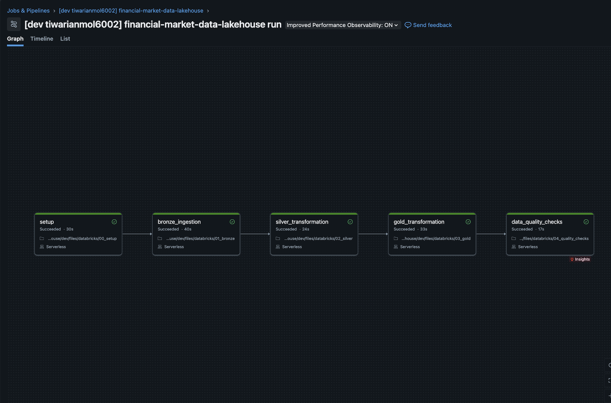

# Financial Market Data Lakehouse

An end-to-end data-engineering project: market data is collected with Python/yfinance, stored in **AWS S3**, processed in **Databricks** with **PySpark + SQL** into **Delta** tables using a **Bronze / Silver / Gold** architecture, and orchestrated by a **Databricks Job** (deployed with Declarative Automation Bundles) triggered from **GitHub Actions**.

```
GitHub Actions (cron, Mon-Fri)
        |
        v
Python / yfinance  --->  AWS S3 (raw/)  --->  Databricks Job
                                                 setup -> bronze -> silver -> gold -> quality checks
                                                                                   |
                                                                                   v
                                                                         SQL analytics / dashboard
                                                                         (optional) MLflow
```

## Pipeline run
Successful Databricks job run (setup -> bronze -> silver -> gold -> data-quality checks):



## Data

10 stocks (AAPL, MSFT, NVDA, AMZN, GOOGL, META, TSLA, JPM, V, WMT), daily prices from 2016, company metadata and annual financial statements.
Edit `src/ingestion/config.py` to change tickers or the start date.

| Layer | Tables |
|---|---|
| Bronze | `stock_prices`, `company_metadata`, `financials` (raw + `source_file`, `bronze_ingested_at`) |
| Silver | typed, validated, de-duplicated versions of the above |
| Gold | `daily_returns`, `volatility_metrics`, `sector_performance`, `company_fundamentals` |

Gold highlights: daily/cumulative returns (on adjusted close), 20/50-day moving averages, 30-day rolling and annualized volatility (x sqrt(252)), drawdown, trend signal, max drawdown and return-to-risk per ticker, equal-weighted sector index, and fundamentals ratios (net margin, debt-to-equity, ROE).

> Sector performance is an **equal-weighted** average, not a market-cap-weighted index.

## Repository layout

```
src/ingestion/      config.py, market_data.py     (yfinance -> parquet)
databricks/         00_setup, 01_bronze, 02_silver, 03_gold, 04_quality_checks, 05_ml_optional
sql/                00_unity_catalog_setup.sql, analytics.sql, data_quality.sql
resources/          finance_job.job.yml            (Databricks Job definition)
databricks.yml      bundle configuration
scripts/            setup_s3.sh, sync_to_s3.sh
iam/                least-privilege policy for the GitHub Actions AWS user
.github/workflows/  ci.yml, financial_pipeline.yml
tests/              pytest unit tests for ingestion helpers
```

## Setup, step by step

### 1. Local environment (macOS)
```bash
python3 -m venv .venv && source .venv/bin/activate
pip install -r requirements-dev.txt
pytest -q
```

### 2. Run ingestion locally
```bash
python src/ingestion/market_data.py
find data/raw -type f
```
Open one file and look at it before uploading:
```python
import pandas as pd
df = pd.read_parquet("data/raw/stock_prices/AAPL.parquet"); print(df.head(), df.shape, df.dtypes)
```

### 3. AWS
```bash
brew install awscli && aws configure          # use an IAM user, never the root account
BUCKET=<your-unique-bucket> REGION=ap-south-1 ./scripts/setup_s3.sh
BUCKET=<your-unique-bucket> ./scripts/sync_to_s3.sh
```
S3 bucket names are global: if `anmol-financial-lakehouse-2026` is taken, pick another and update it in `sql/00_unity_catalog_setup.sql`, `scripts/*.sh`, `iam/github_actions_policy.json` and `.github/workflows/financial_pipeline.yml`.

### 4. Databricks <-> S3
**Route A (AWS workspace / trial):** create a storage credential for the bucket (Catalog Explorer automated setup creates the IAM role), then run `sql/00_unity_catalog_setup.sql`. This creates the external location and the external volume `/Volumes/finance_lakehouse/bronze/raw_financial_data`.

**Route B (Free Edition, no custom S3):** create a *managed* volume (last lines of the SQL file), upload the parquet files into it, and keep S3 as the raw archive.

### 5. Deploy and run the job
```bash
brew tap databricks/tap && brew install databricks
databricks auth login --host https://YOUR-WORKSPACE-URL
databricks bundle validate -t dev
databricks bundle deploy -t dev
databricks bundle run financial_lakehouse_job -t dev
```
Task order: `setup -> bronze_ingestion -> silver_transformation -> gold_transformation -> data_quality_checks`. If the volume path differs, override it: `databricks bundle deploy -t dev --var raw_base=/Volumes/<catalog>/<schema>/<volume>`.

### 6. Automate everything with GitHub Actions
Add these repository secrets (Settings -> Secrets and variables -> Actions):

| Secret | Purpose |
|---|---|
| `AWS_ACCESS_KEY_ID`, `AWS_SECRET_ACCESS_KEY` | IAM user with the policy in `iam/github_actions_policy.json` |
| `DATABRICKS_HOST` | e.g. `https://dbc-xxxx.cloud.databricks.com` |
| `DATABRICKS_TOKEN` | Databricks personal access token (Settings -> Developer -> Access tokens) |

The workflow runs weekdays at 18:00 IST (and on demand): ingest -> upload to S3 -> deploy bundle -> run the Databricks job. Scheduling lives in GitHub Actions on purpose; a Databricks-only schedule could not fetch fresh data from Yahoo.

### 7. Analytics
Run `sql/analytics.sql` in the Databricks SQL editor. Suggested dashboard tiles: latest prices, price vs 50-day MA, cumulative return, rolling volatility, sector index, top performers, risk/return table, revenue and net income.

### 8. Optional: MLflow
Run `databricks/05_ml_optional.py` manually (needs a cluster with scikit-learn/MLflow, e.g. ML runtime). It trains a next-day direction baseline with a time-based split.

## Design decisions worth explaining in an interview
- **Long-format financials** in raw/bronze: statement schemas differ per company, so line items are rows, and Gold pivots only the metrics it needs (with alternative source names coalesced).
- **Adjusted close for returns**, plain close for moving averages and the price-vs-MA signal.
- **Rolling metrics are NULL until the full window exists** instead of being computed on partial data.
- **Silver keeps the latest-ingested row** per ticker/date and enforces price/volume sanity rules; the quality job **fails loudly** if anything slips through.
- **Idempotent overwrite loads**: fine at this size; for larger data move to incremental `MERGE`/Auto Loader.
- **Secrets** live only in GitHub Secrets / local `~/.aws`, never in the repo.

## Limitations
yfinance is an unofficial scraper of Yahoo data: fine for a portfolio project, not for production use. Annual statements typically cover only the last ~4 years.

## Resume bullets
- Built an end-to-end financial data lakehouse on AWS S3 and Databricks using Delta Lake and a Bronze/Silver/Gold architecture.
- Engineered PySpark/SQL pipelines computing returns, moving averages, rolling volatility, drawdowns and sector indices for 10 equities over 10 years.
- Automated ingestion and deployment with GitHub Actions and Databricks Jobs (Asset Bundles), including data-quality gates that fail the pipeline on violations.

## Deployment note (Databricks Free Edition)
This repo was run on Databricks Free Edition, which cannot read custom S3 locations. The workflow therefore archives raw data in S3 **and** copies the same files into a Unity Catalog managed volume (`finance_lakehouse.bronze.raw_financial_data`), which the Bronze notebook reads. On a full AWS workspace you can instead create an external location/volume on the S3 bucket (see `sql/00_unity_catalog_setup.sql`) and delete the "Copy fresh data" workflow step.
